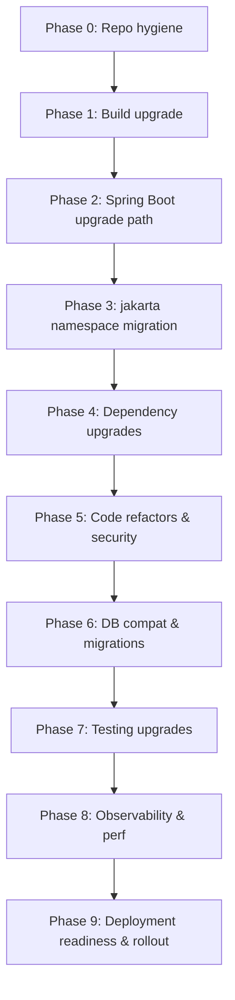

# ModernRepo Java 21 Migration Plan and Dependency Mapping

## Executive Summary

This document provides an actionable migration plan to modernize ModernRepo from Spring Boot 2.5.5 on Java 11 to a Java 21 compatible baseline on Spring Boot 3.3.x. The plan aligns ModernRepo with the Java-21 scaffolding (Spring Boot 3.3.5, OpenAPI via springdoc 2.x, Actuator, and a standardized configuration). It defines phased execution, risk and rollback guidance, verification steps, and a comprehensive dependency mapping to Java 21–compatible artifacts. The modernization goals include:
- Upgrading the runtime to Java 21 with a clean, reproducible build via Maven Wrapper.
- Aligning Spring Boot from 2.5.5 to 3.3.x using the supported upgrade path (2.5.5 → 2.7.x → 3.0.x → 3.3.x).
- Migrating javax.* APIs to jakarta.* (JPA/Validation).
- Ensuring PostgreSQL integration remains robust with up-to-date drivers and Hibernate 6 dialects.
- Maintaining REST APIs with OpenAPI documentation using springdoc 2.x and preserving pagination and validation behaviors.
- Improving observability via Actuator and Micrometer, and reinforcing testing (JUnit 5, Testcontainers for PostgreSQL).

## Assumptions and Scope

- Current ModernRepo:
  - Spring Boot 2.5.5; Java 11; Maven build.
  - Dependencies: spring-boot-starter-web, spring-boot-starter-data-jpa, spring-boot-starter-validation, PostgreSQL JDBC (runtime), H2 (dev), springdoc-openapi-ui 1.6.14, spring-boot-starter-test.
  - Configuration exposes OpenAPI at /openapi.json and Swagger UI at /docs.
  - Profiles managed via application.properties (dev: H2, prod: PostgreSQL), with start.sh defaulting to dev.

- Target baseline (Java-21 scaffolding):
  - Spring Boot 3.3.5; Java 17 fallback for build convenience with a target path to Java 21.
  - OpenAPI via org.springdoc:springdoc-openapi-starter-webmvc-ui:2.6.0.
  - Actuator and an example OpenAPI configuration; Swagger UI is available at /docs and API JSON at /openapi.json.

- Out of scope:
  - Frontend changes.
  - Large domain refactors beyond namespace/API compatibility for Boot 3/Java 21.
  - Native image/AOT production rollout (we include readiness notes only).

## References to the Current Codebase and Scaffolding

- ModernRepo (current state):
  - ModernRepo/Modern-Backend/pom.xml (Spring Boot 2.5.5, Java 11)
  - ModernRepo/Modern-Backend/src/main/resources/application.properties (springdoc paths and profiles)
  - ModernRepo/start.sh (profile selection and start behavior)

- Java-21 scaffolding (target baseline):
  - Java-21/pom.xml (Spring Boot 3.3.5, compiler plugin 3.11.0)
  - Java-21/src/main/resources/application.yaml (OpenAPI paths /openapi.json and /docs)
  - Java-21/src/main/java/com/example/java21/config/OpenApiConfig.java (OpenAPI setup)
  - Java-21/src/main/java/com/example/java21/web/HealthController.java (health endpoint)
  - Java-21/README.md (build and wrapper guidance)

## Pre-Migration Checklist

- Establish a short code freeze window for the migration branches with a clear feature cutoff date.
- Ensure CI builds are green on the main branch for ModernRepo.
- Back up PostgreSQL schema and data; export schemas plus a minimal restore plan.
- Validate environment parity: JDK versions across dev/CI/staging/prod, Postgres versions, and OS images.
- Define a maintenance window or use a feature flag if any schema changes are required later.
- Identify owners for each migration phase and define acceptance criteria per phase (see phases below).
- Confirm observability endpoints (Actuator) and logging sinks exist in non-prod for verification.

## Readiness and Compatibility Assessment

### JDK-Level Considerations (Java 11 → 21)
- Ensure build agents and local dev machines have JDK 21 available (or use Maven Toolchains). During the transition, compilation may temporarily target 17 to keep CI green.
- GC defaults changed; ZGC/Shenandoah are available in 21. Keep defaults unless validated in performance tests.
- TLS and security providers evolve in newer JDKs; revalidate TLS connectivity to databases and any external services.
- The standard Java HTTP client (java.net.http) is mature; if used in the project, re-check timeouts and TLS settings.

### javax.* → jakarta.* Namespace Migration
- All JPA and Validation imports must change: javax.persistence.* → jakarta.persistence.*, javax.validation.* → jakarta.validation.*.
- Confirm all dependency artifacts are Java 21 compatible and aligned to Spring Framework 6 (required by Spring Boot 3).

### Deprecated/Removed APIs
- Hibernate 6 removes/changes several APIs from Hibernate 5.x. Review entity annotations, naming strategies, custom types, and query APIs (e.g., CriteriaQuery) if customized.
- Spring Security (if added later) requires a new configuration style using SecurityFilterChain beans rather than WebSecurityConfigurerAdapter.

### Module System and Reflection
- If explicit modules are used (module-info.java), ensure opens directives account for reflection used by Spring/Hibernate (or rely on classpath without modules).
- Native/AOT (optional): If aiming for native images later, track reflection requirements and consider AOT hints.

## Migration Plan Phases



### Phase 0: Repository Hygiene
- Ensure code is formatted and static analysis passes (spotbugs/checkstyle, if present).
- Ensure unit/integration tests pass on the current main branch.
- Confirm no SNAPSHOT dependencies are blocking release builds.

Acceptance criteria: Current branch builds green; baseline test coverage recorded.

### Phase 1: Build System Upgrade
- Add/standardize Maven Wrapper across ModernRepo (Wrapper 3.2.0 downloading Maven 3.9.7 as in Java-21).
- Set maven-compiler-plugin to use <release>21</release> for final target. During transition you may keep release=17 if necessary to pass CI prior to Boot 3 migration.
- Keep surefire plugin at 3.x to ensure JUnit 5 test execution with modern JDKs.

Acceptance criteria: mvnw -q -DskipTests package succeeds on CI with targeted release.

### Phase 2: Spring Boot Upgrade Path (2.5.5 → 2.7.x → 3.0.x → 3.3.x)
- First upgrade to Boot 2.7.x and fix deprecations (low risk).
- Upgrade to Boot 3.0.x; this is where jakarta migration becomes required.
- Finally upgrade to 3.3.x and re-check configuration keys and actuator endpoints.
- springdoc migration: replace springdoc-openapi-ui (1.x) with springdoc-openapi-starter-webmvc-ui (2.x). Paths remain configurable; use /openapi.json and /docs to align with Java-21 scaffolding.
- If native images are a future goal, review AOT hints after reaching 3.3.x.

Acceptance criteria: Application starts and smoke tests pass on each step; OpenAPI available at /openapi.json; Swagger UI at /docs.

### Phase 3: Namespace Migration to Jakarta
- Bulk replace javax.persistence.* → jakarta.persistence.* and javax.validation.* → jakarta.validation.* across entities, DTOs, and controllers where applicable.
- Rebuild and fix compilation issues; adjust imports in repositories and configuration classes.

Acceptance criteria: Project compiles; tests run on Boot 3 (3.0.x target at this step).

### Phase 4: Dependency Upgrades
- Align database driver to a Java 21–compatible PostgreSQL driver (42.7.x).
- Ensure Spring Data JPA and Hibernate are aligned with Boot 3.3’s managed versions (Hibernate 6.x).
- Replace OpenAPI artifacts as per springdoc 2.x migration (starter).

Acceptance criteria: Application boots on Boot 3.3.x; OpenAPI UI renders; DB integration tests pass.

### Phase 5: Code Refactors for Changed/Removed APIs, Security
- Review any direct Hibernate API usage; adapt to 6.x variants.
- If Spring Security is introduced or present, migrate to Spring Security 6 idioms (SecurityFilterChain).

Acceptance criteria: No runtime errors from API removals; security if present is verified.

### Phase 6: Database Compatibility and Migrations
- Validate Hibernate dialect and naming strategies for PostgreSQL under Hibernate 6 (PostgreSQLDialect).
- If schema evolution is needed, introduce Flyway or Liquibase with repeatable and versioned migrations.

Acceptance criteria: Migration tools (if adopted) run cleanly in CI and local; start-up succeeds on empty and pre-existing DB.

### Phase 7: Testing Upgrades
- Ensure JUnit 5 is configured (via spring-boot-starter-test). Update surefire to 3.x.
- Introduce Testcontainers for PostgreSQL integration tests; ensure reproducible CI runs with ephemeral DB.

Acceptance criteria: Unit and integration tests pass locally and in CI; determinism demonstrated via Testcontainers.

### Phase 8: Performance and Observability
- Enable Actuator endpoints used for health, metrics, and info exposure in non-prod (and production as appropriate).
- Validate Micrometer metrics export; confirm logging (Logback/SLF4J 2.x) behavior and MDC where used.

Acceptance criteria: Health/metrics endpoints verified; logs and dashboards confirm service health during load testing.

### Phase 9: Deployment Readiness and Rollout
- Build final artifacts using Java 21; provide Docker images based on eclipse-temurin:21 (or distroless alternatives).
- Execute blue/green or canary rollout; monitor KPIs and error budgets.

Acceptance criteria: Successful canary and full rollout with KPIs in range for 24–48 hours.

## Risk Matrix and Rollback Strategy

- Risks:
  - Incompatible code due to jakarta migration or Hibernate 6 API differences.
  - Hidden environment drift (JDK or Postgres minor differences) between environments.
  - Changes to logging/metrics impacting dashboards/alerts.

- Mitigations:
  - Incremental upgrade path with test gates at each phase.
  - Testcontainers for DB to reduce environmental drift.
  - Observability smoke tests and dashboards reviewed prior to cutover.

- Rollback:
  - Keep a release branch with Boot 2.5.5/Java 11 binary artifact ready.
  - Maintain DB backward compatibility until after successful production validation.
  - If a migration tool is introduced, make DB changes additive and reversible where feasible; otherwise, gate schema changes behind toggles and scheduled maintenance windows.

## Validation and Verification Plan

- Unit tests: Validate controllers, services, repositories with JUnit 5 and Mockito.
- Integration tests: Use Testcontainers PostgreSQL to validate JPA mappings, pagination, and transaction boundaries.
- Smoke tests: Start application; assert Actuator /actuator/health returns UP and GET /health returns {"status":"ok"}.
- API contract checks: Validate springdoc-generated OpenAPI at /openapi.json, and run an OpenAPI validator against it.
- Performance checks (optional): Small load tests to confirm GC and throughput under Java 21.

## Cutover Plan

- Staging verification with full regression suite and integration tests; compare KPIs versus baseline.
- Blue/green or canary deployment with automated rollback on error rate/latency SLO violations.
- Monitor critical KPIs: request latency (p95/p99), error rates, DB connection pool metrics, GC pauses, and CPU/memory.

## Post-Migration Tasks and Technical Debt Clean-up

- Remove legacy/dead code branches and any temporary compatibility shims.
- Document all new operational runbooks, including updated health checks and metrics endpoints.
- Schedule periodic dependency refresh aligned with Spring Boot 3.3.x maintenance cadence.

## Comprehensive Dependency Mapping

| Component/Area | Current Version/Artifact | Target Version/Artifact (Java 21 compatible) | Change Type | Notes/Actions | Links |
|---|---|---|---|---|---|
| Java | 11 | 21 | Major | Ensure JDK 21 across CI/staging/prod; final builds compiled with release 21. | https://jdk.java.net/21/ |
| Maven (Wrapper) | Not standardized | Wrapper 3.2.0, Maven 3.9.7 | Minor | Adopt Maven Wrapper; align with Java-21 scaffolding. | https://maven.apache.org/wrapper/ |
| Spring Boot | 2.5.5 (parent) | 3.3.5 (parent) | Major | Use upgrade path 2.5.5→2.7.x→3.0.x→3.3.x; adapt config keys as needed. | https://docs.spring.io/spring-boot/docs/3.3.5/reference/ |
| Spring Framework | 5.3.x (managed) | 6.1.x (managed by Boot 3.3.x) | Major | Boot-managed; required for Jakarta migration. | https://spring.io/projects/spring-framework |
| Spring Data JPA | 2.5.x (managed) | 3.3.x (managed) | Major | Boot-managed; verify repository APIs remain compatible. | https://spring.io/projects/spring-data-jpa |
| Hibernate ORM | 5.4.x (managed) | 6.4+/6.5 (managed) | Major | Adjust for Hibernate 6 changes; dialect/queries; naming strategies. | https://hibernate.org/orm/releases/6.4/ |
| PostgreSQL JDBC | org.postgresql:postgresql (managed, ~42.2.x) | org.postgresql:postgresql:42.7.4 | Minor | Align with Java 21; confirm SSL/timezone/Type handling. | https://jdbc.postgresql.org/ |
| H2 (dev) | com.h2database:h2 (runtime) | com.h2database:h2 (latest via Boot) | Minor | Boot-managed; keep for dev/test profile. | https://www.h2database.com/ |
| springdoc-openapi | org.springdoc:springdoc-openapi-ui:1.6.14 | org.springdoc:springdoc-openapi-starter-webmvc-ui:2.6.0 | Major | Artifact change; property keys compatible; keep /openapi.json and /docs. | https://springdoc.org/ |
| Validation | spring-boot-starter-validation (javax) | spring-boot-starter-validation (jakarta) | Major | Imports change to jakarta.validation.*; no artifact rename. | https://docs.spring.io/spring-boot/docs/3.3.5/reference/htmlsingle/#io.validation |
| Jackson | Boot-managed (~2.12.x) | Boot-managed (~2.17.x) | Minor | Ensure any custom modules align; Boot manages versions. | https://github.com/FasterXML/jackson |
| SLF4J/Logback | Boot-managed (slf4j 1.7) | Boot-managed (slf4j 2.x) | Minor | Check MDC, bridges (jul-to-slf4j). | https://www.slf4j.org/ |
| Actuator | Not present or legacy | spring-boot-starter-actuator | Minor | Add for health/metrics; configure exposure per environment. | https://docs.spring.io/spring-boot/docs/3.3.5/actuator/ |
| Micrometer | Not explicitly used | Boot-managed (Micrometer 1.12+) | Minor | Expose key metrics; choose registry (Prometheus/OTel). | https://micrometer.io/ |
| Tests (JUnit) | spring-boot-starter-test (JUnit 5) | spring-boot-starter-test (JUnit 5), surefire 3.x | Minor | Ensure surefire 3.x; migrate any vintage tests if present. | https://junit.org/junit5/ |
| Mockito | Boot-managed (~3.x) | Boot-managed (~5.x) | Minor | Verify mockito-inline if needed. | https://site.mockito.org/ |
| Testcontainers | Not used | org.testcontainers:postgresql:1.20.2 | Addition | Use for DB integration tests in CI. | https://www.testcontainers.org/ |
| Flyway/Liquibase | Not used | org.flywaydb:flyway-core:10.x or liquibase-core:4.27.x | Addition | Optional schema migrations; choose one tool. | https://flywaydb.org/ / https://www.liquibase.org/ |

Notes:
- Several versions are managed by Spring Boot; do not hardcode unless overriding for a specific reason.
- Where current versions are not explicitly declared in ModernRepo, they are inferred via the 2.5.5 parent BOM.

## Environment and CI/CD Updates

- Remove reliance on system maven; use Maven Wrapper for reproducible builds.
- Compiler setup:
  - Interim (pre-Boot 3): maven-compiler-plugin <release>17</release> if needed to keep CI green; Final: <release>21</release>.
- Docker base images:
  - eclipse-temurin:21-jre-jammy or eclipse-temurin:21-alpine as appropriate.
- CI:
  - Cache Maven repository.
  - Run tests with CI=true and surefire 3.x.
  - Run integration tests with Testcontainers; ensure Docker service available or use Testcontainers with container runtime providers supported by your CI.

## PostgreSQL Database Considerations

- Upgrade JDBC driver to 42.7.x; verify:
  - SSL parameters (e.g., sslmode=require) as needed for your environment.
  - Time zone handling via spring.jpa.properties.hibernate.jdbc.time_zone=UTC.
  - Schema selection via spring.jpa.properties.hibernate.default_schema if applicable.
- Hibernate 6 dialect:
  - spring.jpa.properties.hibernate.dialect=org.hibernate.dialect.PostgreSQLDialect (or rely on autodetection).
- Connection pool:
  - Verify HikariCP settings for max pool size and timeouts under production loads.

## API Documentation and springdoc Migration

- Replace:
  - org.springdoc:springdoc-openapi-ui:1.6.14
  - With: org.springdoc:springdoc-openapi-starter-webmvc-ui:2.6.0
- Properties:
  - springdoc.api-docs.path=/openapi.json
  - springdoc.swagger-ui.path=/docs
- Controllers:
  - Continue using io.swagger.v3.oas.annotations.* for operation and tag metadata.
- Confirm /docs renders and /openapi.json is accessible as in the Java-21 scaffolding.

## Appendix

### A. Sample pom.xml snippet for Java 21 and Spring Boot 3.3.x

```xml
<project>
  <parent>
    <groupId>org.springframework.boot</groupId>
    <artifactId>spring-boot-starter-parent</artifactId>
    <version>3.3.5</version>
    <relativePath/>
  </parent>

  <properties>
    <java.version>21</java.version>
    <maven.compiler.release>21</maven.compiler.release>
  </properties>

  <dependencies>
    <!-- Web and Validation (Jakarta) -->
    <dependency>
      <groupId>org.springframework.boot</groupId>
      <artifactId>spring-boot-starter-web</artifactId>
    </dependency>
    <dependency>
      <groupId>org.springframework.boot</groupId>
      <artifactId>spring-boot-starter-validation</artifactId>
    </dependency>

    <!-- Data JPA and PostgreSQL -->
    <dependency>
      <groupId>org.springframework.boot</groupId>
      <artifactId>spring-boot-starter-data-jpa</artifactId>
    </dependency>
    <dependency>
      <groupId>org.postgresql</groupId>
      <artifactId>postgresql</artifactId>
      <version>42.7.4</version>
      <scope>runtime</scope>
    </dependency>

    <!-- Observability -->
    <dependency>
      <groupId>org.springframework.boot</groupId>
      <artifactId>spring-boot-starter-actuator</artifactId>
    </dependency>

    <!-- OpenAPI (springdoc 2.x) -->
    <dependency>
      <groupId>org.springdoc</groupId>
      <artifactId>springdoc-openapi-starter-webmvc-ui</artifactId>
      <version>2.6.0</version>
    </dependency>

    <!-- Test -->
    <dependency>
      <groupId>org.springframework.boot</groupId>
      <artifactId>spring-boot-starter-test</artifactId>
      <scope>test</scope>
    </dependency>
    <dependency>
      <groupId>org.testcontainers</groupId>
      <artifactId>postgresql</artifactId>
      <version>1.20.2</version>
      <scope>test</scope>
    </dependency>
  </dependencies>

  <build>
    <plugins>
      <plugin>
        <groupId>org.springframework.boot</groupId>
        <artifactId>spring-boot-maven-plugin</artifactId>
      </plugin>
      <plugin>
        <groupId>org.apache.maven.plugins</groupId>
        <artifactId>maven-compiler-plugin</artifactId>
        <version>3.11.0</version>
        <configuration>
          <release>${maven.compiler.release}</release>
        </configuration>
      </plugin>
      <plugin>
        <groupId>org.apache.maven.plugins</groupId>
        <artifactId>maven-surefire-plugin</artifactId>
        <version>3.2.5</version>
      </plugin>
    </plugins>
  </build>
</project>
```

### B. Example application.yml (profiles and OpenAPI)

```yaml
spring:
  application:
    name: modernrepo
  datasource:
    url: ${SPRING_DATASOURCE_URL:jdbc:postgresql://localhost:5432/modernrepo}
    username: ${SPRING_DATASOURCE_USERNAME:postgres}
    password: ${SPRING_DATASOURCE_PASSWORD:postgres}
  jpa:
    hibernate:
      ddl-auto: update
    properties:
      hibernate:
        dialect: org.hibernate.dialect.PostgreSQLDialect
        jdbc:
          time_zone: UTC

management:
  endpoints:
    web:
      exposure:
        include: health,info,metrics
  endpoint:
    health:
      show-details: when_authorized

springdoc:
  api-docs:
    path: /openapi.json
  swagger-ui:
    path: /docs
```

### C. Sample Spring Security 6 configuration (optional if/when security is added)

```java
package com.example.security;

import org.springframework.context.annotation.Bean;
import org.springframework.context.annotation.Configuration;
import org.springframework.security.config.Customizer;
import org.springframework.security.config.annotation.web.builders.HttpSecurity;
import org.springframework.security.web.SecurityFilterChain;

@Configuration
public class SecurityConfig {

  @Bean
  SecurityFilterChain securityFilterChain(HttpSecurity http) throws Exception {
    http
      .csrf(csrf -> csrf.disable())
      .authorizeHttpRequests(auth -> auth
        .requestMatchers("/health", "/actuator/**", "/docs", "/openapi.json").permitAll()
        .anyRequest().authenticated()
      )
      .httpBasic(Customizer.withDefaults());
    return http.build();
  }
}
```

### D. Sample Testcontainers PostgreSQL setup with Spring Boot 3

```java
package com.example.postgresdemo;

import org.junit.jupiter.api.Test;
import org.springframework.boot.test.context.SpringBootTest;
import org.springframework.test.context.DynamicPropertyRegistry;
import org.springframework.test.context.DynamicPropertySource;
import org.testcontainers.containers.PostgreSQLContainer;
import org.testcontainers.junit.jupiter.Container;
import org.testcontainers.junit.jupiter.Testcontainers;

@SpringBootTest
@Testcontainers
class PostgresIntegrationTests {

  @Container
  static PostgreSQLContainer<?> postgres = new PostgreSQLContainer<>("postgres:16-alpine");

  @DynamicPropertySource
  static void registerProps(DynamicPropertyRegistry registry) {
    registry.add("spring.datasource.url", postgres::getJdbcUrl);
    registry.add("spring.datasource.username", postgres::getUsername);
    registry.add("spring.datasource.password", postgres::getPassword);
  }

  @Test
  void contextLoads() {
    // add repository tests here
  }
}
```

## Step-by-Step Execution Guidance (Condensed)

1. Create a migration branch and enable Maven Wrapper (align with Java-21).
2. Upgrade to Boot 2.7.x; fix deprecations; keep Java release at 17 if needed.
3. Upgrade to Boot 3.0.x; perform jakarta namespace migration; ensure all code compiles and tests pass.
4. Upgrade to Boot 3.3.5; update springdoc to 2.6.0 and PostgreSQL driver to 42.7.4.
5. Introduce/verify Actuator and Micrometer; revalidate metrics and logs.
6. Integrate Testcontainers for DB tests; ensure CI determinism.
7. Prepare Docker image using Java 21 base; execute canary deployment and observe KPIs.
8. Decommission legacy paths and finalize documentation.

## Alignment with Java-21 Scaffolding

- Configuration: Keep springdoc.api-docs.path=/openapi.json and swagger-ui.path=/docs for a consistent developer experience.
- Health endpoint and Actuator: Mirror the scaffolding’s approach to health checks and runtime exposure policy.
- Build: Adopt the same Maven Wrapper setup and compiler plugin configuration; finalize with release=21.

## Acceptance Criteria Summary

- Builds and tests pass on Spring Boot 3.3.x with Java 21.
- API documentation available at /openapi.json and /docs.
- Database integration verified via Testcontainers and, optionally, Flyway/Liquibase migrations.
- Observability endpoints are functional and monitored; production rollout succeeds with no regression in core KPIs.

